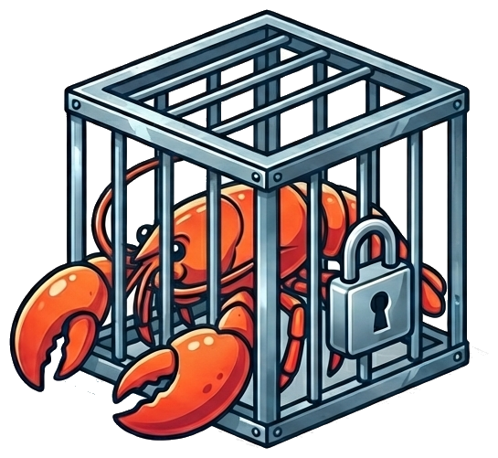

<p align="center">
  
</p>

# agentcage

*Defense-in-depth proxy sandbox for AI agents.*

Because "the agent would never do that" is not a security policy.

> :warning: **Warning:** This is an experimental project. It has not been audited by security professionals. Use it at your own risk. See [Security & Threat Model](docs/security.md) for details and known limitations.

> **Setting up OpenClaw?** See the [OpenClaw guide](docs/openclaw.md) and [`openclaw/config.yaml`](examples/openclaw/).

## What is it?

agentcage is a CLI that generates hardened, sandboxed environments for AI agents. In the default **container mode**, it produces [systemd quadlet](https://docs.podman.io/en/latest/markdown/podman-systemd.unit.5.html) files that deploy three containers on a rootless [Podman](https://podman.io/) network -- no root privileges required. In **[Firecracker](https://firecracker-microvm.github.io/) mode**, the same container topology runs inside a dedicated microVM with its own Linux kernel, providing hardware-level isolation via KVM. In both modes, your agent runs on an internal-only network with no internet gateway; the only way out is through an inspecting [mitmproxy](https://mitmproxy.org/) that scans every HTTP request before forwarding it.

## Features

- :mag: **Pluggable inspector chain** -- domain filtering, secret detection, payload analysis, and custom Python inspectors
- :key: **Bidirectional secret injection** -- agent gets placeholders, proxy injects outbound, redacts inbound
- :detective: **Regex-based secret scanning** -- automatic provider-to-domain mapping, extensible via config
- :bar_chart: **Payload analysis** -- Shannon entropy, content-type mismatch detection, base64 blob scanning, body-size limits
- :globe_with_meridians: **WebSocket frame inspection** -- same inspector chain applied to every frame post-handshake
- :satellite: **DNS filtering** -- dnsmasq sidecar, RFC 5737 placeholder IPs for non-allowlisted domains, query logging
- :stopwatch: **Per-host rate limiting** -- token-bucket with configurable burst
- :pencil: **Structured audit logging** -- JSON lines for all inspection decisions (block, flag, allow)
- :lock: **Container hardening** -- read-only rootfs, all capabilities dropped, `no-new-privileges`
- :package: **Supply chain hardening** -- pinned base image digests, lockfile integrity, SHA-256 patch verification

## Design Principles

1. :no_entry: **Fail-closed** -- if any component fails, traffic stops, not bypasses.
2. :shield: **Secure by default** -- all hardening is on out of the box; security is opt-out, not opt-in.
3. :mag: **Inspect, don't just isolate** -- every request, frame, and query is analyzed before forwarding.
4. :closed_lock_with_key: **Agent never holds real secrets** -- placeholders in, real values injected in transit only.
5. :scroll: **Audit everything** -- all decisions logged as structured JSON by default.

## Why is it needed?

Most AI agent deployments hand the agent a [**lethal trifecta**](https://simonwillison.net/2025/Jun/16/the-lethal-trifecta/):

1. :globe_with_meridians: **Internet access** -- the agent can reach any server on the internet.
2. :key: **Secrets** -- tokens and other secrets are passed as environment variables or mounted files.
3. :computer: **Arbitrary code execution** -- the agent runs code it writes itself, or code suggested by a model.

Any one of these alone is manageable. Combined, they create an exfiltration risk: if the agent is compromised, misaligned, or simply makes a mistake, it can send your secrets, source code, or private data to any endpoint on the internet. Most current setups have zero defense against this -- the agent has the same network access as any other process on the machine.

agentcage breaks the trifecta by placing the agent behind a defense-in-depth proxy sandbox: network isolation, domain filtering, secret injection, secret scanning, payload analysis, and container hardening -- all fail-closed. See [Security & Threat Model](docs/security.md) for the full breakdown of each layer and known limitations.

## How is it different?

Most agent sandboxes stop at network-level isolation: put the agent in a VM or container and control which hosts it can reach. agentcage adds a full inspection layer on top -- every HTTP request, WebSocket frame, and DNS query passes through a pluggable inspector chain before reaching the internet.

The agent never holds real secrets. Secret injection gives the agent placeholder tokens (`{{ANTHROPIC_API_KEY}}`); the proxy swaps in real values on outbound requests and redacts them from inbound responses. If a placeholder is sent to an unauthorized domain, the request is blocked. The secrets inspector provides a second line of defense with regex-based secret scanning that detects common key formats, each with automatic provider-to-domain mapping so legitimate API calls pass through without manual configuration.

On top of domain filtering and secret detection, the inspector chain analyzes payloads for anomalies -- Shannon entropy (catching encrypted/compressed exfiltration), content-type mismatches, base64 blobs -- and inspects WebSocket frames with the same chain. All decisions are written as structured JSON audit logs.

agentcage runs natively on headless Linux using rootless Podman -- fully self-hosted, single-binary CLI, open source.

## How does it work?

A cage is three containers on an internal Podman network: your agent (no internet gateway), a dual-homed DNS sidecar, and a dual-homed mitmproxy that inspects and forwards all traffic.

```
  podman network: <name>-net (--internal, no internet gateway)
  ┌──────────────────────────────────────────────────────────────────┐
  │                                                                  │
  │  ┌──────────────┐    ┌───────────────┐    ┌──────────────────┐  │
  │  │ Agent         │    │ DNS sidecar   │    │ mitmproxy        │  │
  │  │               │    │ (dnsmasq)     │    │ + inspector chain│  │
  │  │ HTTP_PROXY=  ─┼────┼───────────────┼───►│                  │  │
  │  │  10.89.0.11  ─┼────┼───────────────┼──►│ scans + forwards─┼──┼─► Internet
  │  │               │    │               │    │                  │  │
  │  │ resolv.conf  ─┼───►│ resolves via  │    │                  │  │
  │  │               │    │ external net ─┼────┼──────────────────┼──┼─► Upstream DNS
  │  │               │    │               │    │                  │  │
  │  │ ONLY on       │    │ internal +    │    │ internal +       │  │
  │  │ internal net  │    │ external net  │    │ external net     │  │
  │  └──────────────┘    └───────────────┘    └──────────────────┘  │
  │                                                                  │
  └──────────────────────────────────────────────────────────────────┘
```

All HTTP traffic is routed via `HTTP_PROXY` / `HTTPS_PROXY` to the mitmproxy container. A pluggable inspector chain evaluates every request -- enforcing domain allowlists, scanning for secret leaks, analyzing payloads -- before forwarding or blocking with a 403. The chain short-circuits on the first hard block.

See [Architecture](docs/architecture.md) for the full inspector chain, startup order, and certificate sharing.

## Isolation Modes

agentcage supports two isolation modes. Both share the same three-container topology and inspector chain — the difference is what provides the outer isolation boundary.

| | Container mode (default) | Firecracker mode |
|---|---|---|
| **Isolation** | Linux namespaces (rootless Podman) | Hardware virtualization (KVM) |
| **Kernel** | Shared with host | Dedicated guest kernel per cage |
| **Container escape risk** | Mitigated by hardening, not eliminated | Eliminated — escape lands in VM, not on host |
| **Root required** | No | Yes (for TAP device and bridge setup) |
| **macOS support** | Yes (via Podman machine) | No (requires `/dev/kvm`) |
| **Boot overhead** | ~1s | ~7s |
| **Best for** | Development, CI, low-risk workloads | Production, untrusted agents, high-security |

Set `isolation: firecracker` in your config to use Firecracker mode. See [Firecracker MicroVM Isolation](docs/firecracker.md) for setup and details.

## Prerequisites

- [Podman](https://podman.io/) (rootless)
- Python 3.12+
- [uv](https://docs.astral.sh/uv/) (Python package manager)

### Linux

**Arch Linux:**

```bash
sudo pacman -S podman python uv
```

**Debian / Ubuntu (24.04+):**

```bash
sudo apt install podman python3
curl -LsSf https://astral.sh/uv/install.sh | sh
```

**Fedora:**

```bash
sudo dnf install podman python3 uv
```

### macOS

```bash
brew install podman python uv
podman machine init
podman machine start
```

> **Note:** On macOS, Podman runs containers inside a Linux VM. `podman machine init` creates and `podman machine start` starts it.

### Firecracker Mode (optional)

Firecracker mode requires Linux with `/dev/kvm` access. See [Firecracker setup](docs/firecracker.md#setup) for full prerequisites. macOS is not supported for Firecracker mode.

## Install

```bash
curl -fsSL https://raw.githubusercontent.com/agentcage/agentcage/master/install.sh | sh
```

This installs agentcage and all prerequisites (Podman, Python 3.12+, uv). For Firecracker mode:

```bash
curl -fsSL https://raw.githubusercontent.com/agentcage/agentcage/master/install.sh | sh -s -- --with-firecracker
```

Or install manually:

```bash
uv tool install agentcage            # from PyPI (when published)
uv tool install git+https://github.com/agentcage/agentcage.git  # from GitHub
```

For development:

```bash
git clone https://github.com/agentcage/agentcage.git
cd agentcage
uv run agentcage --help
```

## Updating Dependencies

All dependencies are pinned (lock files, image digests, binary checksums). To check for updates:

```bash
./scripts/update-deps.py              # check all, report only
./scripts/update-deps.py --update     # check all, apply updates
./scripts/update-deps.py containers   # check a single category
```

Categories: `python`, `containers`, `firecracker`, `kernel`, `node`, `pip`.

Requires `skopeo` for container image checks (`sudo pacman -S skopeo` on Arch).

## Usage

```bash
# 1. Write your config
cp examples/basic/config.yaml config.yaml
vim config.yaml

# 2. Store secrets (before creating the cage)
agentcage secret set myapp ANTHROPIC_API_KEY
agentcage secret set myapp GITHUB_TOKEN

# 3. Create the cage (builds images, generates quadlets, starts containers)
agentcage cage create -c config.yaml

# 4. Verify it's healthy
agentcage cage verify myapp

# 5. View logs
agentcage cage logs myapp             # agent logs
agentcage cage logs myapp -s proxy    # proxy inspection logs
agentcage cage logs myapp -s dns      # DNS query logs

# 6. Audit inspection decisions
agentcage cage audit myapp                          # last 100 entries
agentcage cage audit myapp --summary --since 24h    # daily summary
agentcage cage audit myapp -f --json -d blocked     # alerting pipeline

# 7. Update after code/config changes
agentcage cage update myapp -c config.yaml

# 8. Rotate a secret (auto-reloads the cage)
agentcage secret set myapp ANTHROPIC_API_KEY

# 9. Restart without rebuild (config-only change)
agentcage cage reload myapp

# 10. Tear it all down
agentcage cage destroy myapp
```

## CLI Overview

| Group | Commands |
|---|---|
| `cage` | `create`, `update`, `list`, `destroy`, `verify`, `reload`, `audit` |
| `secret` | `set`, `list`, `rm` |
| `domain` | `list`, `add`, `rm` |

See [CLI Reference](docs/cli.md) for full documentation of all commands and options.

## Deployment State

agentcage tracks each cage in `~/.config/agentcage/deployments/<name>/config.yaml`. This stored config copy allows commands like `cage update` (without `-c`) and `cage reload` to operate without requiring the original config file. The state is removed when a cage is destroyed.

## Architecture

See [Architecture](docs/architecture.md) for the full container topology, inspector chain, startup order, and certificate sharing.

## Configuration

See the [Configuration Reference](docs/configuration.md) for all settings, defaults, and examples. Example configs: [`basic/config.yaml`](examples/basic/) | [`openclaw/config.yaml`](examples/openclaw/)

## Security

The agent has no internet gateway -- all traffic must pass through the proxy, which applies domain filtering, secret detection, payload inspection, and custom inspectors. For workloads requiring hardware-level isolation, Firecracker mode adds a dedicated guest kernel per cage, eliminating container escape as an attack vector. See [Security & Threat Model](docs/security.md) for the full threat model, defense layers, and known limitations.

## License

MIT
